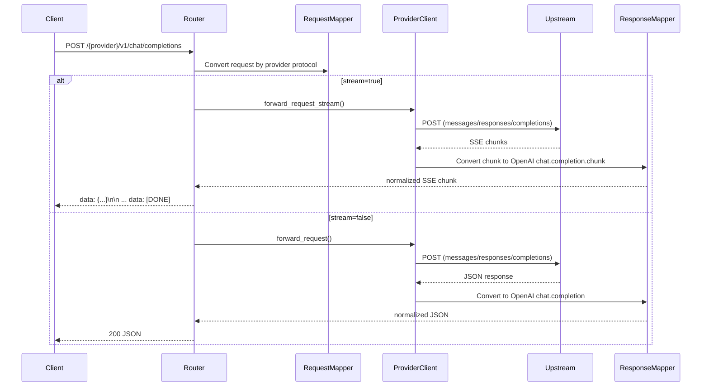

# LLM Gateway

A lightweight LLM API gateway that accepts OpenAI `chat/completions` requests and forwards them to downstream `completions` or `responses` protocols based on provider configuration.

## Features

- Rust-based high-performance async forwarding
- Multi-provider routing (OpenAI, Anthropic, and custom OpenAI-compatible services)
- Protocol adaptation `completions -> responses -> completions`
- Global concurrency protection and global rate limiting
- Configurable CORS, request timeout, and `/metrics` auth
- Graceful shutdown (SIGINT/SIGTERM)
- Structured logging and metrics

## Protocol Mapping

- Clients always call `/{provider}/v1/chat/completions`
- If `protocol: "responses"` is configured, the gateway converts both request and response automatically
- For streaming, responses events are converted into `chat.completion.chunk` SSE

## Quick Start

### 1) Prepare config

```bash
cp config.yaml.example config.yaml
cp .env.template .env
```

`.env` example:

```env
OPENAI_API_KEY=...
ANTHROPIC_API_KEY=...
GATEWAY_API_KEY=...   # optional
```

### 2) Run

```bash
cargo run
```

Default address: `http://localhost:8080`

### 3) Health check

```bash
curl http://localhost:8080/health
```

## Configuration

```yaml
server:
  address: "0.0.0.0"
  port: 8080
  request-timeout-seconds: 930
  cors:
    allow-any-origin: false
    allow-origins: []  # backend-only default; set explicit origins for browser use
  limits:
    max-in-flight-requests: 512
    max-requests-per-second: 200
  metrics:
    require-auth: true  # recommended in production to protect /metrics
  resilience:
    provider-max-concurrency: 128
    retry-max-attempts: 3
    circuit-breaker-failure-threshold: 8

providers:
  openai:
    models: ["gpt-4o-mini"]
    base-url: "https://api.openai.com"

  anthropic:
    models: ["claude-3-5-sonnet"]
    base-url: "https://api.anthropic.com"
    version: "2023-06-01"

  my-responses-provider:
    models: ["gpt-4.1-mini"]
    base-url: "https://api.example.com"
    protocol: "responses"
```

### `server` Parameter Reference

| Parameter | Type | Description |
|---|---|---|
| `address` | `string` | Bind address. `0.0.0.0` listens on all interfaces |
| `port` | `u16` | Listen port |
| `request-timeout-seconds` | `u64` | Per-request timeout in seconds; returns `504` on timeout |
| `cors.allow-any-origin` | `bool` | Whether to allow any CORS origin; `true` means `*` |
| `cors.allow-origins` | `string[]` | CORS origin allowlist; effective only when `allow-any-origin: false` |
| `limits.max-in-flight-requests` | `usize?` | Global in-flight concurrency limit |
| `limits.max-requests-per-second` | `u64?` | Global requests-per-second limit |
| `metrics.require-auth` | `bool` | Whether `/metrics` requires gateway authentication |
| `resilience.provider-max-concurrency` | `usize` | Per-provider bulkhead concurrency limit |
| `resilience.retry-max-attempts` | `u32` | Max retries for transient transport errors |
| `resilience.circuit-breaker-failure-threshold` | `u32` | Consecutive failure threshold for circuit breaker |

Fixed internal defaults (not configurable):
- Initial retry backoff: `100ms`
- Max retry backoff: `1000ms`
- Circuit breaker open duration: `20s`

- `server.metrics.require-auth` only takes effect when `GATEWAY_API_KEY` is set
- `/health` is always unauthenticated
- With `allow-any-origin: false` and `allow-origins: []`, CORS is closed by default (recommended for backend-only usage)

## API Endpoints

| Endpoint | Method | Description |
|---|---|---|
| `/health` | GET | Health check |
| `/metrics` | GET | Metrics (auth configurable) |
| `/{provider}/v1/chat/completions` | POST | Unified chat completions entry |

## Architecture

```mermaid
flowchart LR
  C[Client SDK / HTTP Client] --> G[LLM Gateway<br/>Axum Server]

  subgraph GW[Gateway Core]
    G --> M1[Middlewares<br/>CORS / Auth / RateLimit / ConcurrencyLimit]
    M1 --> R[Router<br/>/health /metrics /{provider}/v1/chat/completions]
    R --> D[Dispatcher]
    R --> L[RequestLogger + MetricsCollector]
  end

  D --> P1[ProviderClient: openai]
  D --> P2[ProviderClient: anthropic]
  D --> P3[ProviderClient: custom providers]

  subgraph MAP[Protocol Mapping Layer]
    Q1[RequestMapper<br/>chat/completions -> target protocol]
    Q2[ResponseMapper<br/>target protocol -> chat/completions]
  end

  R --> Q1
  Q1 --> P1
  Q1 --> P2
  Q1 --> P3

  P1 --> U1[Upstream OpenAI-compatible API]
  P2 --> U2[Upstream Anthropic Messages API]
  P3 --> U3[Upstream Responses/Completions API]

  U1 --> Q2
  U2 --> Q2
  U3 --> Q2
  Q2 --> R
  R --> C
```

### Request Path (Streaming / Non-Streaming)



## Custom Providers

Add a provider in `config.yaml`, then set `{PROVIDER}_API_KEY` in `.env`. Provider names are uppercased and `-` is replaced with `_`.

## Production Notes

- Put a reverse proxy in front (TLS, WAF, IP controls)
- For multi-instance deployments, use distributed rate limiting (Redis / Envoy / Nginx)
- Keep API keys in environment variables only, never commit them
