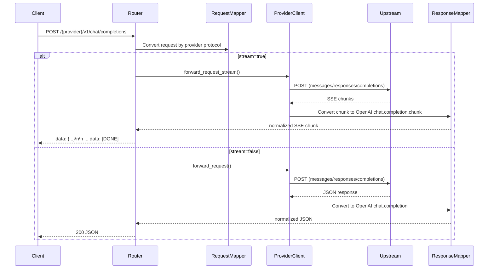

# LLM Gateway

一个轻量级的 LLM API 网关，统一接收 OpenAI `chat/completions` 请求，并按 provider 配置转发到下游 `completions` 或 `responses` 协议。

## 特性

- Rust 实现，异步高性能转发
- 多 provider 路由（OpenAI、Anthropic、以及自定义 OpenAI 兼容服务）
- 协议适配 `completions -> responses -> completions`
- 全局并发保护与全局限流
- 可配置 CORS、请求超时、`/metrics` 鉴权
- 优雅停机（SIGINT/SIGTERM）
- 结构化日志与性能指标

## 协议映射

- 客户端统一调用 `/{provider}/v1/chat/completions`
- 若 provider 配置 `protocol: "responses"`，网关会自动做请求和响应双向转换
- 流式场景会将 responses 事件转换为 `chat.completion.chunk` SSE

## 快速开始

### 1) 准备配置

```bash
cp config.yaml.example config.yaml
cp .env.template .env
```

`.env` 示例：

```env
OPENAI_API_KEY=...
ANTHROPIC_API_KEY=...
GATEWAY_API_KEY=...   # 可选
```

### 2) 启动服务

```bash
cargo run
```

默认地址：`http://localhost:8080`

### 3) 健康检查

```bash
curl http://localhost:8080/health
```

## 配置说明

```yaml
server:
  address: "0.0.0.0"
  port: 8080
  request-timeout-seconds: 930
  cors:
    allow-any-origin: false
    allow-origins: []  # backend-only 默认不允许跨域；前端场景请填具体 origin
  limits:
    max-in-flight-requests: 512
    max-requests-per-second: 200
  metrics:
    require-auth: true  # 建议生产开启，保护 /metrics
  resilience:
    provider-max-concurrency: 128
    retry-max-attempts: 3
    circuit-breaker-failure-threshold: 8

providers:
  openai:
    models: ["gpt-4o-mini"]
    base-url: "https://api.openai.com"

  anthropic:
    models: ["claude-3-5-sonnet"]
    base-url: "https://api.anthropic.com"
    version: "2023-06-01"

  my-responses-provider:
    models: ["gpt-4.1-mini"]
    base-url: "https://api.example.com"
    protocol: "responses"
```

### `server` 参数说明

| 参数 | 类型 | 说明 |
|---|---|---|
| `address` | `string` | 服务监听地址，`0.0.0.0` 表示监听所有网卡 |
| `port` | `u16` | 服务监听端口 |
| `request-timeout-seconds` | `u64` | 单次请求超时（秒），超时返回 `504` |
| `cors.allow-any-origin` | `bool` | 是否允许任意来源跨域；`true` 为 `*` |
| `cors.allow-origins` | `string[]` | CORS 来源白名单，仅在 `allow-any-origin: false` 时生效 |
| `limits.max-in-flight-requests` | `usize?` | 全局并发请求上限 |
| `limits.max-requests-per-second` | `u64?` | 全局每秒请求上限（RPS） |
| `metrics.require-auth` | `bool` | 是否要求 `/metrics` 通过网关鉴权 |
| `resilience.provider-max-concurrency` | `usize` | 单 provider 并发隔离上限（bulkhead） |
| `resilience.retry-max-attempts` | `u32` | 传输层瞬时错误最大重试次数 |
| `resilience.circuit-breaker-failure-threshold` | `u32` | 熔断连续失败阈值 |

固定默认（不可配置）：
- 重试初始退避：`100ms`
- 重试最大退避：`1000ms`
- 熔断打开时间：`20s`

- `server.metrics.require-auth` 仅在设置 `GATEWAY_API_KEY` 后生效
- `/health` 永远免认证
- `allow-any-origin: false` 且 `allow-origins: []` 时默认不放开跨域（后端场景推荐）

## API 端点

| 端点 | 方法 | 描述 |
|---|---|---|
| `/health` | GET | 健康检查 |
| `/metrics` | GET | 性能指标（可配置鉴权） |
| `/{provider}/v1/chat/completions` | POST | 统一聊天补全入口 |

## 架构图

```mermaid
flowchart LR
  C[Client SDK / HTTP Client] --> G[LLM Gateway<br/>Axum Server]

  subgraph GW[Gateway Core]
    G --> M1[Middlewares<br/>CORS / Auth / RateLimit / ConcurrencyLimit]
    M1 --> R[Router<br/>/health /metrics /{provider}/v1/chat/completions]
    R --> D[Dispatcher]
    R --> L[RequestLogger + MetricsCollector]
  end

  D --> P1[ProviderClient: openai]
  D --> P2[ProviderClient: anthropic]
  D --> P3[ProviderClient: custom providers]

  subgraph MAP[Protocol Mapping Layer]
    Q1[RequestMapper<br/>chat/completions -> target protocol]
    Q2[ResponseMapper<br/>target protocol -> chat/completions]
  end

  R --> Q1
  Q1 --> P1
  Q1 --> P2
  Q1 --> P3

  P1 --> U1[Upstream OpenAI-compatible API]
  P2 --> U2[Upstream Anthropic Messages API]
  P3 --> U3[Upstream Responses/Completions API]

  U1 --> Q2
  U2 --> Q2
  U3 --> Q2
  Q2 --> R
  R --> C
```

### 请求路径（流式 / 非流式）



## 自定义 Provider

在 `config.yaml` 增加 provider，并在 `.env` 配置 `{PROVIDER}_API_KEY`。provider 名会自动转大写并将 `-` 替换为 `_`。

## 生产建议

- 建议在网关前加反向代理（TLS、WAF、IP 限制）
- 多实例部署时，建议使用分布式限流（Redis / Envoy / Nginx）
- API keys 仅放在环境变量，不要提交到仓库
